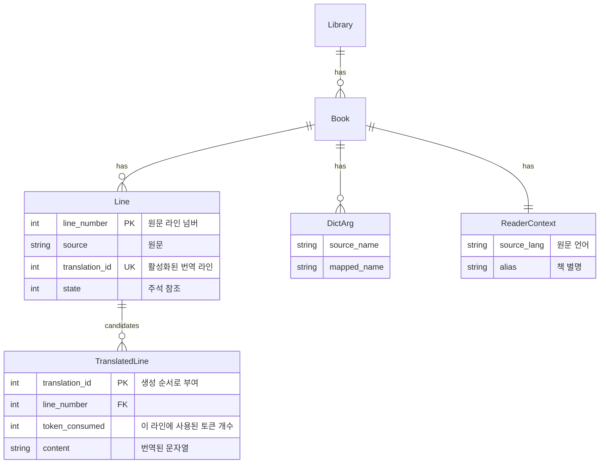

# 프로그램 설계

```mermaid
erDiagram
    Line {
        int line_number PK "원문 라인 넘버"
        string source "원문"
        int translation_id UK "활성화된 번역 라인"
        int state "주석 참조"
    }

    DictArg {
        string source_name
        string mapped_name
    }

    TranslatedLine {
        int translation_id PK "생성 순서로 부여"
        int line_number FK
        int token_consumed "이 라인에 사용된 토큰 개수"
        string content "번역된 문자열"
    }

    Book ||--o{ Line: "has"

    Library ||--o{ Book: "has"

    Book ||--|| ReaderContext: "has"

    Book ||--o{ DictArg: "has"

    ReaderContext {
        string source_lang "원문 언어"
        string alias "책 별명"
    }

    Line ||--o{ TranslatedLine: candidates
```

- `Line::state`
  - `0 :=` 암묵적 승인.
