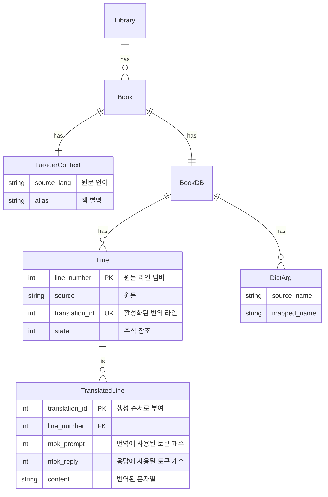

# 프로그램 설계

```mermaid
erDiagram
    Line {
        int line_number PK "원문 라인 넘버"
        string source "원문"
        int translation_id UK "활성화된 번역 라인"
        int state "주석 참조"
    }

    DictArg {
        string source_name
        string mapped_name
    }

    TranslatedLine {
        int translation_id PK "생성 순서로 부여"
        int line_number FK
        int ntok_prompt "번역에 사용된 토큰 개수"
        int ntok_reply "응답에 사용된 토큰 개수"
        string content "번역된 문자열"
    }

    ReaderContext {
        string source_lang "원문 언어"
        string alias "책 별명"
    }

    Library ||--o{ Book: "has"
    Book ||--|| BookDB: "has"
    Book ||--|| ReaderContext: "has"
    BookDB ||--o{ Line: "has"
    BookDB ||--o{ DictArg: "has"
    Line ||--o{ TranslatedLine: is
```

- `Line::state`
  - `0 :=` 암묵적 승인. 앞에서
  - `1 :=` 명시적 승인. 어떤 경우에도 추가적인 번역은 일어나지 않습니다.
  - `2 :=` 개별 재번역. 이 문장만 다시 번역될 예정입니다.
  - `3 :=` 이후 전체 재번역. 이 행 이후의 모든 라인이 invalidation 됩니다.
